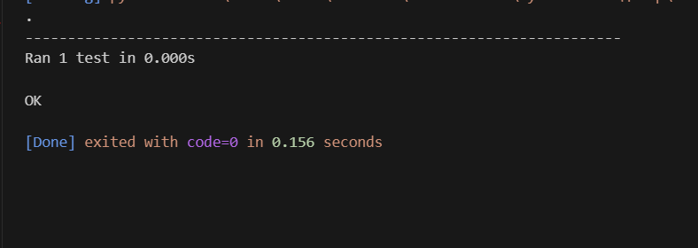

## Білет 12
## Практичне завдання
 У файлі main.py створіть функцію find_min(numbers: list), яка повертає мінімальне число зі списку. Тест: У файлі test.py протестуйте функцію на списку з цілими та дробовими числами.
```
Python test.py

```
