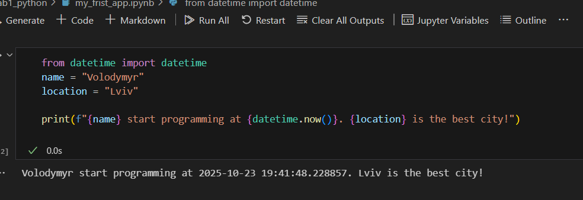

# Звіт до роботи
## Тема: Вступні заняття: налаштування середовища, прочаток роботи з Python та Markdown
### Мета роботи: Налаштувати середовище роботи VS Code, створити репозиторій Github та налаштувати інтеграцію з ним, написати першу програму на Python та створити звіт з використанням форматування Markdown;


---
### Виконання роботи
* Результати виконання завдання *1...N*;
    1. Розробили/Створили ...
    1. Програма вивела значення: Volodymyr start programming at 2025-10-23 19:38:58.021574. Lviv is the best city!
    1. Отримав наступні результати: Програма працює правильно,код спрацював у всіх методах виклику:<<Terminal,bash,jupyter>> файл з розширенням <<ipynb>> також вивів результат
    1. Навчився налаштоувати середовище робиоти VS Code та створювати репозиторії в Github
* вставлені рисунки 
    
    

* вставлений код / текстовий або числовий результат / інші результати:
    - from datetime import datetime
name = "Volodymyr"
location = "Lviv"
print(f"{name} start programming at {datetime.now()}. {location} is the best city!");
* результати виконання індивідуального завдання (якщо такі є);

---

### Перша програма штучного інтелекту (ChatGPT)

> Запитання: Яку б першу програму написав штучний інтелект та чи міг би він її пояснити?

```python
# Моя перша програма
print("Hello, human! I am AI, and this is my first program.")
```
### Висновок:
> у висновку відповідаю на запитання:

- :question: **Що зроблено в роботі:** я написав першу програму на Python, яка успішно виконувалася.  
- :question: **Чи досягнуто мети роботи:** так, усе працювало як задумано.  
- :question: **Які нові знання отримано:** робота з плагіном Jupyter, створення комірок з кодом та Markdown, запуск і виведення результатів.  
- :question: **Чи вдалось відповісти на всі питання задані в ході роботи:** так.  
- :question: **Чи вдалося виконати всі завдання:** так.  
- :question: **Чи виникли складності у виконанні завдання:** ні.  
- :question: **Чи подобається такий формат здачі роботи (Feedback):** так, писати звіт за допомогою Markdown досить цікаво.  
- :question: **Побажання для покращення (Suggestions):** можливо додати більше прикладів інтерактивного використання Markdown та Jupyter для звітів.
