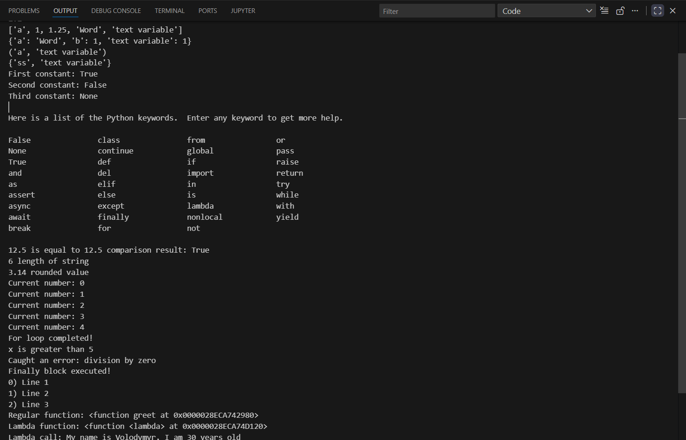
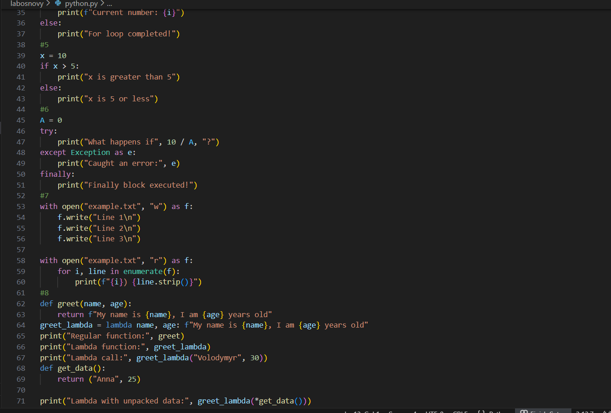

# Звіт до роботи
## Тема: Основи програмування Python
### Мета роботи:Навчитись застосовувати основні конструкції мови Python, виконати всі приклади та з використанням AI створити власні приклади, які демонструють особливості кодових конструкцій Pyhton


---
### Виконання роботи
* Результати виконання завдання *3*;
    1. Програма вивела значення:
    1. Отримав наступні результати: Програма працює правильно,код спрацював у всіх методах виклику.Весь код для 8 завдань успішно працює.
    1. Ознайомився та навчився використовувати основні конструкції мови Python,виконкав всі поставлені завдання,а також створив приклади від ШІ,які демонструють особливості кодових конструкцій Python
* вставлені рисунки    
    
    

* вставлений код / текстовий або числовий результат / інші результати:
    - #4
x = 10
if x > 5:
    print("x is greater than 5")
else:
    print("x is 5 or less")
* результати виконання індивідуального завдання (якщо такі є);

---

### Про основи програмування на Python від ШІ

> Запитання: Запитайте у АІ як би він розписав про основи Python (задайте промпт вказавши що ви вивчаєте Python з використанням Jupyter Notebook). Спробуйте виконати приклади Python коду та вставте їх відповіді у звіт?

```
Основи Python
# ===============================================
# Основи Python – всі теми з прикладами та результатами
# ===============================================

print("===== 1. Вивід на екран =====")
print("Привіт, Python!\n")

print("===== 2. Змінні та типи даних =====")
name = "Володимир"      # рядок
age = 25                # ціле число
height = 1.78           # число з плаваючою точкою
is_student = True       # булевий тип
print("Змінні:", name, age, height, is_student, "\n")

print("===== 3. Операції з числами =====")
a, b = 10, 3
addition = a + b
subtraction = a - b
multiplication = a * b
division = a / b
integer_div = a // b
modulus = a % b
power = a ** b
print("Додавання:", addition)
print("Віднімання:", subtraction)
print("Множення:", multiplication)
print("Ділення:", division)
print("Цілочисельне ділення:", integer_div)
print("Остача від ділення:", modulus)
print("Піднесення до степеня:", power, "\n")

print("===== 4. Списки (list) =====")
fruits = ["яблуко", "банан", "вишня"]
first_fruit = fruits[0]
fruits.append("груша")
fruits.remove("банан")
print("Список фруктів:", fruits)
print("Перший фрукт:", first_fruit, "\n")

print("===== 5. Умовні оператори =====")
x = 15
if x > 10:
    result = "Більше за 10"
elif x == 10:
    result = "Рівно 10"
else:
    result = "Менше за 10"
print("Результат перевірки числа:", result, "\n")

print("===== 6. Цикли =====")
print("Цикл for:")
for i in range(1, 6):
    print(i, end=" ")
print("\nЦикл while:")
count = 0
while count < 3:
    print("Привіт!", end=" ")
    count += 1
print("\n")

print("===== 7. Функції =====")
def greet(name):
    return f"Привіт, {name}!"
print(greet("Володимир"), "\n")

print("===== 8. Словники (dict) =====")
person = {"ім'я": "Володимир", "вік": 25, "студент": True}
person_name = person["ім'я"]
person["рідне місто"] = "Київ"
print("Словник person:", person)
print("Ім'я з словника:", person_name, "\n")

print("===== 9. Робота з рядками =====")
text = "Python - це цікаво!"
print("Довжина рядка:", len(text))
print("Великі літери:", text.upper())
print("Чи містить підрядок 'цікаво'?", "цікаво" in text)

```
### Висновок:
> ---

## 1. Що було виконано в роботі
- Вивчено основні типи даних у Python: `int`, `float`, `str`, `bool`, `list`, `tuple`, `dict`, `set`.  
- Відпрацьовано використання умовних операторів (`if`, `elif`, `else`).  
- Виконано практичні приклади циклів `for` та `while`.  
- Ознайомлено з лямбда-функціями та стандартними вбудованими функціями (`abs`, `len`, `round`).  
- Реалізовано приклади роботи з файлами за допомогою контекст-менеджера `with`.  
- Вивчено обробку помилок через конструкцію `try → except → finally`.  
- Створено власні приклади коду з використанням AI для демонстрації можливостей Python.  

## 2. Чи досягнуто мети роботи
Мета роботи досягнута: опановано базові конструкції Python, створено власні приклади коду та виконано всі поставлені завдання.  

## 3. Нові знання, отримані під час роботи
- Розуміння основних типів даних та структур у Python.  
- Навички застосування циклів і умовних конструкцій.  
- Вміння створювати та використовувати лямбда-функції.  
- Знання про роботу з файлами та обробку помилок.  
- Досвід використання AI для генерації власних прикладів коду.  

## 4. Чи вдалося відповісти на всі поставлені питання
Так, усі питання щодо типів даних, циклів, умовних операторів, функцій та обробки помилок були розглянуті та опрацьовані.  

## 5. Чи виконані всі завдання
Так, усі лабораторні та додаткові практичні завдання виконані успішно.  

## 6. Чи виникали труднощі під час виконання завдання
- На початку виникли незначні труднощі з імпортом функцій (`randint`) та синтаксисом лямбда-функцій.  
- Всі проблеми були успішно вирішені.  

## 7. Чи подобається формат виконання роботи (Feedback)
Так, формат з поетапним виконанням прикладів у Jupyter Notebook і використанням AI для генерації власного коду є зручним і наочним.  

## 8. Побажання щодо покращення (Suggestions)
- Додати більше практичних завдань на комбінування різних конструкцій (цикли + умовні оператори + словники).  
- Включати короткі пояснення до кожного прикладу прямо у ноутбуку для кращого розуміння.  
- Додати вправи з використанням модулів і бібліотек Python для практичного застосування знань.
